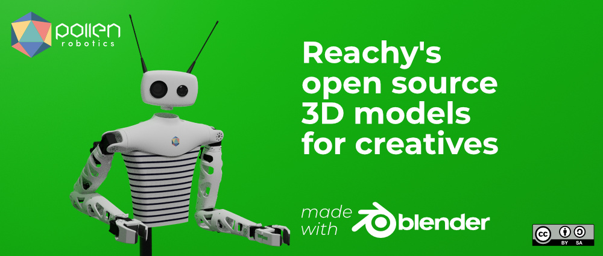
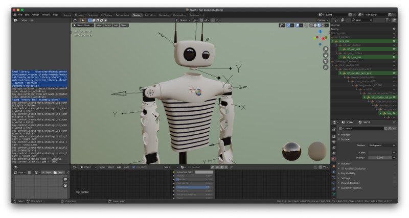

# Reachy's Blender models for creatives

Reachy is an actual open source real robot made by the humans of [Pollen Robotics](https://www.pollen-robotics.com/). You can discover what it can do in the real life in the following video presentation:

Reachy is designed with a CAD tool but we decided to import his 3D models in blender to **offer the robot 3D asset to the community of creatives** made of artists, game designer, video makers or whoever wants to have fun with a virtual robot! 

Our models are **distributed under Creatives Commons Attribution-Share-alike 4.0 License**, so feel free to do whatever you want with those 3D models! Just please do not forget to give us credit for the robot and share back if you improve the models :)

As the 3D files are quite heavy, they are not versionned with git, you will find them on the [releases page](/releases), just take the last one!

You will find materials, subassemblies and the fully assembled Reachy. 

You can move each joint in the exact same way as the real robot. Motors are simulated with empties rotating around Z axis, all joint are named like "blala_joint" so you can easily find them in the tree.

For any question, do not hesitate to fill [a new issue](/issues) or have a chat with us on [our forum](https://forum.pollen-robotics.com/)!
